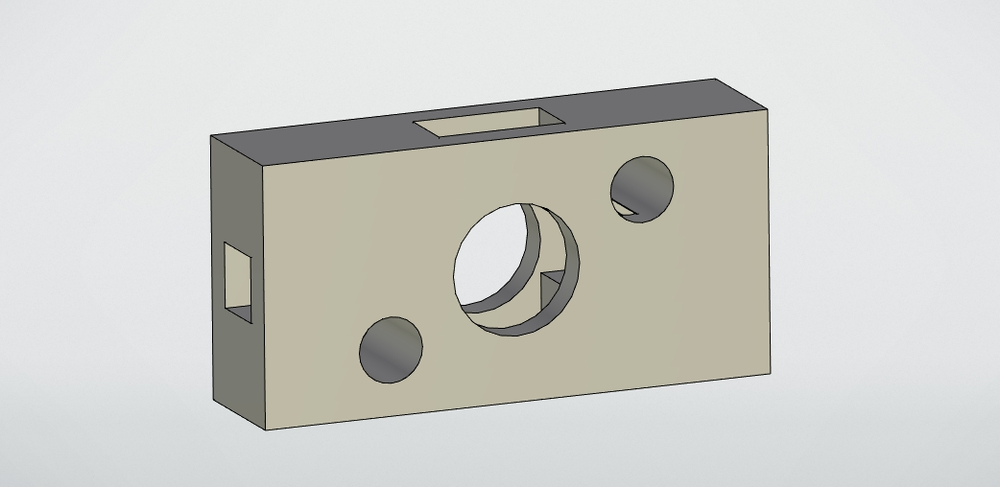
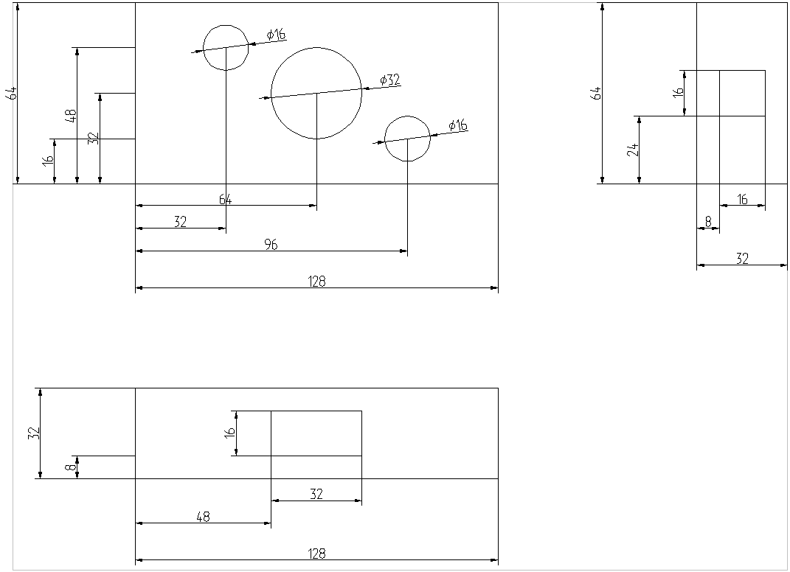

# Чертёж без ИИ и API

(пока есть ощущение, что получится фигня)

## Что получается сейчас:

Скрипт строет проекции (втупую, как в step написано, так и делает), находит все **цилиндрические** и **прямоугольные** отверстия **в параллелепипеде** и расставляет их размеры. Также расставляет габаритные размеры.

Больше ничего не делает.

### Пример:

Геометрия (`test.stp`):



Чертеж (`test.dxf`):



Расположения размеров можно подправить (и в коде, и вручную), будет покрасивей.

### Хорошие новости:

Размеры можно двигать как в T-FLEXе (как? см. блок "Как двигать размеры")

### Плохие новости:

Больше нет ничего общего с чертежом T-FLEXа.

И это не проблема скрипта, который написан, это проблема самого формата DXF (либо того, как T-FLEX его читает). 

Поясню: если создать чертеж в T-FLEXе и экспортировать его в DXF, а потом импортировать этот DXF в T-FLEX, то получится даже хуже, чем рисует мой скрипт.

## Как двигать размеры

Сначала вопрос: как импортировали?

1. Если галочка "Конвертировать блоки во фрагменты" не нажата, тогда размеры можно смело двигать сразу. Но, если захочется подвинуть саму деталь (проекцию), то двигаться будут все линии поотдельности.
2. Если галочка "Конвертировать блоки во фрагменты" нажата, тогда размеры сразу двигать не получится (будет двигаться вся проекция). *Что же делать???* Нужно нажать на деталь и найти кнопку "Раскрыть фрагмент" (или "Раскрыть фрагмент с построением", хз чем они отличеются) во всплывающем окне нажать, чтобы не объединялось в группу. Всё, размеры можно двигать.

## Если хочется попробовать: Как установить CadQuery

> **ВАЖНО:** Если установлен `pythonocc-core`, установка CadQuery **сломает окружение**. CadQuery использует свою скомпилированную версию ядра OCC, которая называется `ocp`, и она конфликтует с пакетом `pythonocc-core`.

**Рекомендуемый способ (через Conda/Mamba):**
Это самый надежный способ, который создаст изолированное окружение с правильной версией ядра.
1. Установите [Miniconda](https://docs.conda.io/en/latest/miniconda.html) или [Miniforge](https://github.com/conda-forge/miniforge) (у меня Miniforge).
2. Создайте новое окружение:
   ```bash
   conda create -n cq_env python=3.10
   conda activate cq_env
   ```
3. Установите CadQuery (он автоматически подтянет правильный `ocp`):
   ```bash
   conda install -c conda-forge cadquery
   ```
4. Установите остальные нужные библиотеки в это же окружение:
   ```bash
   pip install ezdxf numpy
   ```

## Ниже README, который написал квен:

## 🚀 Возможности

- **Распознавание признаков (Feature Recognition):** Автоматически находит цилиндрические (отверстия, валы) и прямоугольные (пазы, карманы) элементы в 3D-модели, игнорируя геометрический шум и дубликаты.
- **Ортогональные проекции:** Генерирует виды спереди (Front), сверху (Top) и слева/справа (Right) с корректным алгоритмом удаления скрытых линий (HLR).
- **Интеллектуальная сборка геометрии:** Автоматически "сшивает" разорванные дуги в полноценные окружности (`Circle`), если они были разбиты из-за пересечения с другими элементами.
- **Автоматическая простановка размеров по ГОСТ:**
  - Диаметральные размеры (`Ø`) для круглых отверстий.
  - Линейные и выровненные размеры для прямоугольных элементов.
  - Координаты центров отверстий от базовых кромок.
  - Габаритные размеры детали.
- **Умная компоновка (Tiered Layout):** Размеры выстраиваются в "лесенку" с фиксированными отступами, что физически исключает их пересечение друг с другом или с контуром детали.
- **Группировка в блоки (Blocks):** Каждый вид и его размеры объединяются в DXF-блок, что позволяет в CAD-программе перемещать или масштабировать вид целиком, сохраняя привязки.

## 📖 Использование

1. Поместите ваш 3D-файл в формате `.stp` или `.step` в папку со скриптом (по умолчанию скрипт ожидает файл `test.stp`).
2. Запустите скрипт:
   ```bash
   python no_ML_and_API/code/test.py
   ```
3. На выходе вы получите файл `test.dxf`.

## 🧠 Как это работает (Архитектура)

Скрипт работает в 3 последовательных этапа:

1. **Анализ 3D-геометрии:** Скрипт перебирает все грани (`Faces`) модели. Если грань является цилиндром (`GeomAbs_Cylinder`), извлекаются её радиус, центр и ось. Координаты округляются для дедупликации (объединения фрагментов одного отверстия, разбитых булевыми операциями).
2. **Построение проекций (OCP/OpenCASCADE):** Для каждого вида создается виртуальная камера (`gp_Ax2`). Запускается алгоритм `HLRBRep_Algo` для расчета видимых контуров. Полученные ребра классифицируются: если сумма углов дуг с одинаковым центром и радиусом близка к $2\pi$, они объединяются в объект `Circle`.
3. **Генерация DXF (ezdxf):** 
   - Геометрия рисуется в DXF-блоке.
   - Запускается алгоритм кластеризации внутренних линий для поиска прямоугольных вырезов.
   - Размеры наносятся строго по уровням (Tiers): сначала размеры самих элементов (ближе к детали), затем привязки к базам, затем габариты (дальше от детали). Это гарантирует отсутствие пересечений.

## ⚠️ Известные ограничения

- Скрипт оптимизирован для **призматических деталей** с отверстиями и пазами. Для сложных органических поверхностей логика распознавания признаков может потребовать доработки.
- Для корректного отображения толщины линий (`lineweight`) в вашей CAD-программе (AutoCAD, NanoCAD, Компас, LibreCAD) **должна быть включена опция отображения весов линий** (например, кнопка `LWT` или команда `LWDISPLAY` -> `1`) (В T-FLEXе так не работает).